# OmniForge Current Architecture Diagrams

## Overview

This document provides visual diagrams of the current OmniForge architecture, highlighting areas with SOLID principle violations.

---

## 1. Tool Execution System (Current State)

### Component Diagram

### Problems Highlighted
- 🔴 **SRP Violation**: ToolExecutor has 5+ responsibilities
- 🔴 **DIP Violation**: ReasoningEngine accesses `_executor._registry` (private member)
- 🔴 **ISP Violation**: All dependencies required even when not needed

---

## 2. Database System (Current State)

### Component Diagram

### Problems Highlighted
- 🔴 **OCP Violation**: Cannot add new session patterns without modifying code
- 🔴 **SRP Violation**: Handles engine creation, session management, AND runtime detection
- 🔴 **Type Safety**: Union[Session, AsyncSession] loses type information
- 🔴 **Performance**: Runtime context detection on every session creation

---

## 3. Tool Definition System (Current State)

### Class Diagram

```mermaid
classDiagram
    class ToolDefinition {
        ❌ ISP VIOLATION: Fat Interface
        +name: str
        +type: ToolType
        +description: str
        +parameters: list~ToolParameter~
        +timeout_ms: Optional~int~
        +retry_config: Optional~ToolRetryConfig~
        +cache_ttl_seconds: Optional~int~
        +visibility: ToolVisibilityConfig
        +permissions: ToolPermissions
        +cost_estimate: Optional~float~
        +tags: list~str~
    }

    class BashTool {
        Uses: name, type, description, timeout_ms
        ❌ Forced to provide: retry_config, cache_ttl, permissions
        Even though not needed!
    }

    class ReadTool {
        Uses: name, type, description
        ❌ Forced to provide: timeout_ms, retry_config, permissions
        Even though read-only!
    }

    class LLMTool {
        Uses: ALL fields
        Only tool that needs everything!
    }

    BashTool --> ToolDefinition : "forced dependency"
    ReadTool --> ToolDefinition : "forced dependency"
    LLMTool --> ToolDefinition : "needs all"

    note for ToolDefinition "11 configuration concerns\nForced on ALL tools\nEven simple ones!"
```

### Problems Highlighted
- 🔴 **ISP Violation**: Tools forced to implement 11 config concerns
- 🔴 **Complexity**: Simple tools need complex configuration
- 🔴 **Coupling**: All tools coupled to full definition model

---

## 4. LLM Tool Provider Setup (Current State)

### Sequence Diagram

### Problems Highlighted
- 🔴 **OCP Violation**: Adding new provider requires modifying `_setup_litellm()`
- 🔴 **Extensibility**: Cannot add providers without code changes
- 🔴 **Testability**: Difficult to test provider-specific logic

---

## 5. Agent-Tool-Registry Dependencies (Current State)

### Dependency Graph

### Problems Highlighted
- 🔴 **DIP Violation**: High-level modules depend on concrete implementations
- 🔴 **Coupling**: Direct access to private members (`_registry`)
- 🔴 **Testability**: Cannot mock easily - need real instances

---

## 6. Streaming Tool Hierarchy (Current State)

### Class Hierarchy Diagram

### Problems Highlighted
- 🔴 **LSP Violation**: StreamingTool not substitutable for BaseTool
- 🔴 **Polymorphism**: Need runtime type checks
- 🔴 **Parallel Hierarchies**: Two execution patterns instead of unified

---

## 7. Complete System Architecture (Current State)

### High-Level Architecture

### Legend
- 🔴 Red Components: SOLID Violations
- Solid Lines: Direct Dependencies
- Dashed Lines: Optional Dependencies
- ❌: Specific Violation Type

---

## 8. Data Flow (Current State)

### Request Processing Flow

```mermaid
sequenceDiagram
    participant User
    participant API
    participant Agent as SimpleAutonomousAgent
    participant Engine as ReasoningEngine
    participant Executor as ToolExecutor (❌ SRP)
    participant Tool as BashTool
    participant DB as Database (❌ OCP)

    User->>API: POST /chat
    API->>Agent: run(prompt)
    Agent->>Engine: reason(task)

    loop Reasoning Loop
        Engine->>Engine: call_llm()
        Engine->>Executor: execute(tool_name, args)

        Executor->>Executor: ❌ Check rate limit<br/>❌ Validate skills<br/>❌ Record call<br/>❌ Track cost<br/>❌ Execute tool
        Executor->>Tool: execute()
        Tool-->>Executor: ToolResult

        Executor->>Executor: ❌ Record result<br/>❌ Track cost
        Executor-->>Engine: ToolResult

        Engine->>DB: ❌ session()<br/>Runtime detection!
        DB-->>Engine: Union[Session, AsyncSession]
        Note over DB: Type safety lost!
    end

    Engine-->>Agent: final_answer
    Agent-->>API: response
    API-->>User: JSON response
```

---

## Metrics Summary

### Current Architecture Issues

| Layer | Violations | Complexity | Coupling |
|-------|-----------|------------|----------|
| Tool Execution | SRP, DIP, ISP | Very High (15+) | Very High |
| Database | OCP, SRP | High (12+) | High |
| Tool Definition | ISP | Medium | High |
| LLM Tool | OCP, DIP | Medium | Medium |
| Agent Layer | DIP | Medium | High |

### Technical Debt

### Cyclomatic Complexity Hot Spots

---

## Next Steps

See the following documents for refactoring plans:
1. `01-tool-executor-refactoring-plan.md` - Fix SRP violations in ToolExecutor
2. `02-database-refactoring-plan.md` - Fix OCP violations in Database
3. `03-proposed-architecture-diagrams.md` - See improved architecture
