# OmniForge Proposed Architecture (After SOLID Refactoring)

## Overview

This document shows the improved architecture after applying SOLID principles refactoring.

---

## 1. Tool Execution System (Proposed)

### Component Diagram - Improved


### Improvements
- ✅ **SRP**: Each component has one responsibility
- ✅ **DIP**: ReasoningEngine depends on protocol, not concrete class
- ✅ **OCP**: Can add new execution strategies without modifying core
- ✅ **Testability**: Each component mockable independently

### Code Comparison

**Before:**
```python
class ToolExecutor:
    async def execute(...):
        # 97 lines doing everything:
        # - Rate limiting
        # - Skill validation
        # - Chain recording
        # - Cost tracking
        # - Tool execution
        # - Retry logic
```

**After:**
```python
class ToolExecutor:
    def __init__(self, registry, rate_limiter, cost_tracker):
        self._skill_manager = SkillManager(registry)      # Delegation
        self._rate_checker = RateLimitChecker(rate_limiter)  # Delegation
        self._cost_recorder = CostRecorder(cost_tracker)    # Delegation
        self._chain_recorder = ChainRecorder()              # Delegation

    async def execute(...):
        # 30 lines orchestrating components:
        await self._rate_checker.check_rate_limit(...)
        self._skill_manager.validate_skill_access(...)
        call_id = self._chain_recorder.record_call(...)
        result = await self._execute_with_retry(...)  # Core logic
        self._chain_recorder.record_result(...)
        await self._cost_recorder.record_cost(...)
        return result
```

---

## 2. Database System (Proposed)

### Component Diagram - Improved


### Improvements
- ✅ **OCP**: New session patterns via composition (no modification)
- ✅ **SRP**: AsyncDatabase only does async, SyncDatabase only does sync
- ✅ **Type Safety**: Clear types (AsyncSession vs Session)
- ✅ **Performance**: No runtime detection, only needed engine created

### Code Comparison

**Before:**
```python
class Database:
    def __init__(self, url):
        self._engine = create_engine(url)      # Both!
        self._async_engine = create_async_engine(url)  # Both!

    async def session(self):
        if self._is_async_context():  # ❌ Runtime detection!
            async with AsyncSession(...):
                yield session
        else:  # ❌ Can't extend!
            with Session(...):
                yield session
```

**After:**
```python
# Clear separation
class AsyncDatabase:
    def __init__(self, url):
        self._engine = create_async_engine(url)  # Only async!

    async def session(self) -> AsyncIterator[AsyncSession]:
        async with self._session_factory() as session:
            yield session  # ✅ Clear type!

class SyncDatabase:
    def __init__(self, url):
        self._engine = create_engine(url)  # Only sync!

    def session(self) -> Iterator[Session]:
        with self._session_factory() as session:
            yield session  # ✅ Clear type!

# Usage
db = DatabaseFactory.create("postgresql+asyncpg://...")  # Auto-select!
async with db.session() as session:  # Type: AsyncSession
    # Use session
```

**Extensibility (OCP):**
```python
# NEW: Add transaction support WITHOUT modifying core classes!
class TransactionManager:
    def __init__(self, database: AsyncDatabaseProtocol):
        self._db = database  # Composition, not modification!

    async def transaction(self, isolation_level: str):
        async with self._db.session() as session:
            await session.execute(f"SET ISOLATION LEVEL {isolation_level}")
            yield session

# Usage
tx_manager = TransactionManager(db)
async with tx_manager.transaction("SERIALIZABLE") as session:
    # Transaction with custom isolation level
    # Core database classes unchanged!
```

---

## 3. Tool Definition System (Proposed)

### Class Diagram - Improved


### Improvements
- ✅ **ISP**: Tools only implement configs they need
- ✅ **Flexibility**: Mix and match config interfaces
- ✅ **Simplicity**: Simple tools have simple config

### Code Comparison

**Before:**
```python
# ReadTool forced to provide ALL 11 config fields
read_tool_def = ToolDefinition(
    name="read",
    type=ToolType.FILESYSTEM,
    description="Read files",
    parameters=[],
    timeout_ms=None,           # ❌ Don't need
    retry_config=None,         # ❌ Don't need
    cache_ttl_seconds=None,    # ❌ Don't need
    visibility=...,            # ❌ Don't need
    permissions=...,           # ❌ Don't need
    cost_estimate=None,        # ❌ Don't need
    tags=[],                   # ❌ Don't need
)
```

**After:**
```python
# ReadTool only provides what it needs
class ReadTool(BaseTool):
    executable_config = ExecutableToolConfig(
        name="read",
        type=ToolType.FILESYSTEM,
        description="Read files",
        parameters=[],  # ✅ Only essential config!
    )
    # Done! No unused config fields.

# BashTool needs resilience
class BashTool(BaseTool):
    executable_config = ExecutableToolConfig(...)
    resilient_config = ResilientToolConfig(
        timeout_ms=30000,
        retry_config=ToolRetryConfig(max_retries=3),
    )  # ✅ Only what it needs!

# LLMTool needs everything
class LLMTool(BaseTool):
    executable_config = ExecutableToolConfig(...)
    resilient_config = ResilientToolConfig(...)
    cacheable_config = CacheableToolConfig(cache_ttl_seconds=3600)
    secure_config = SecureToolConfig(permissions=...)
    # Makes sense - complex tool has complex config
```

---

## 4. LLM Tool Provider Setup (Proposed)

### Sequence Diagram - Improved

```mermaid
sequenceDiagram
    participant Client
    participant LLMTool
    participant Registry as ProviderRegistry
    participant Azure as AzureConfigurer
    participant OpenAI as OpenAIConfigurer

    Client->>LLMTool: __init__(config)
    LLMTool->>Registry: get_configurer(provider)

    Note over Registry: ✅ OCP FIXED<br/>Strategy Pattern

    alt provider == "azure"
        Registry->>Azure: configure(config)
        Azure->>Azure: Set Azure-specific env vars
        Azure-->>LLMTool: configured
    else provider == "openai"
        Registry->>OpenAI: configure(config)
        OpenAI->>OpenAI: Set OpenAI-specific env vars
        OpenAI-->>LLMTool: configured
    end

    Note over Registry: To add new provider:<br/>✅ Just add new Configurer!<br/>✅ No modification to LLMTool!

    LLMTool-->>Client: ready
```



### Improvements
- ✅ **OCP**: Add new providers without modifying LLMTool
- ✅ **SRP**: Each configurer handles one provider
- ✅ **Testability**: Each provider configurer testable independently

### Code Comparison

**Before:**
```python
class LLMTool:
    def _setup_litellm(self, config):
        # ❌ Hardcoded provider logic
        if config.provider == "azure":
            os.environ["AZURE_API_BASE"] = config.azure_endpoint
            os.environ["AZURE_API_VERSION"] = config.azure_version
        elif config.provider == "openai":
            os.environ["OPENAI_ORGANIZATION"] = config.organization
        elif config.provider == "anthropic":
            os.environ["ANTHROPIC_API_KEY"] = config.api_key
        # ❌ To add provider: modify this method!
```

**After:**
```python
# Provider interface
class ProviderConfigurer(Protocol):
    def configure(self, config: LLMConfig) -> None:
        """Configure provider-specific settings."""
        ...

# Concrete configurers
class AzureConfigurer(ProviderConfigurer):
    def configure(self, config: LLMConfig) -> None:
        os.environ["AZURE_API_BASE"] = config.azure_endpoint
        os.environ["AZURE_API_VERSION"] = config.azure_version

class OpenAIConfigurer(ProviderConfigurer):
    def configure(self, config: LLMConfig) -> None:
        os.environ["OPENAI_ORGANIZATION"] = config.organization

# Registry
class ProviderRegistry:
    _configurers = {
        "azure": AzureConfigurer(),
        "openai": OpenAIConfigurer(),
        "anthropic": AnthropicConfigurer(),
    }

    @classmethod
    def register(cls, provider: str, configurer: ProviderConfigurer):
        """✅ Add new provider without modification!"""
        cls._configurers[provider] = configurer

    @classmethod
    def get_configurer(cls, provider: str) -> ProviderConfigurer:
        return cls._configurers[provider]

# LLMTool simplified
class LLMTool:
    def _setup_litellm(self, config):
        configurer = ProviderRegistry.get_configurer(config.provider)
        configurer.configure(config)  # ✅ Clean delegation!

# ✅ Add new provider WITHOUT modifying LLMTool!
ProviderRegistry.register("bedrock", BedrockConfigurer())
```

---

## 5. Agent-Tool-Registry Dependencies (Proposed)

### Dependency Graph - Improved


### Improvements
- ✅ **DIP**: High-level depends on abstractions
- ✅ **Testability**: Easy to mock protocols
- ✅ **Flexibility**: Can swap implementations

### Code Comparison

**Before:**
```python
# ❌ Depends on concrete class
class ReasoningEngine:
    def __init__(self, executor: ToolExecutor):  # Concrete type!
        self._executor = executor

    def get_tools(self):
        return self._executor._registry.list_tools()  # ❌ Private access!
```

**After:**
```python
# ✅ Depends on protocol
class ReasoningEngine:
    def __init__(self, executor: ExecutorProtocol):  # Protocol!
        self._executor = executor

    def get_tools(self):
        registry = self._executor.get_registry()  # ✅ Public method!
        return registry.list_tools()

# Mock for testing
class MockExecutor(ExecutorProtocol):
    def get_registry(self) -> RegistryProtocol:
        return MockRegistry()

# Use in tests
engine = ReasoningEngine(MockExecutor())  # ✅ Easy testing!
```

---

## 6. Streaming Tool Hierarchy (Proposed)

### Class Hierarchy - Improved

```mermaid
classDiagram
    class BaseTool {
        <<abstract>>
        ✅ LSP FIXED: Unified Interface
        +definition: ToolDefinition
        +execute(context, args) ToolResult | AsyncIterator
        +supports_streaming() bool
    }

    class ExecutionStrategy {
        <<interface>>
        +execute(tool, context, args) ToolResult
    }

    class StreamingStrategy {
        <<interface>>
        +execute_streaming(tool, context, args) AsyncIterator
    }

    class BashTool {
        +execute() ToolResult
        +supports_streaming() → False
        Uses: ExecutionStrategy ✅
    }

    class LLMTool {
        +execute() → delegates to strategy
        +supports_streaming() → True
        Uses: ExecutionStrategy ✅
        Uses: StreamingStrategy ✅
    }

    BaseTool <|-- BashTool
    BaseTool <|-- LLMTool

    BashTool --> ExecutionStrategy
    LLMTool --> ExecutionStrategy
    LLMTool --> StreamingStrategy

    note for BaseTool "Unified interface<br/>Supports both patterns<br/>✅ No runtime checks needed"
```



### Improvements
- ✅ **LSP**: All tools substitutable
- ✅ **Polymorphism**: No runtime type checks
- ✅ **Flexibility**: Strategy pattern for execution modes

### Code Comparison

**Before:**
```python
# ❌ Client must check type
if isinstance(tool, StreamingTool):
    async for chunk in tool.execute_streaming(...):
        handle_chunk(chunk)
else:
    result = await tool.execute(...)
    handle_result(result)
```

**After:**
```python
# ✅ Unified interface - no type checks!
if tool.supports_streaming():  # Capability check, not type check
    async for chunk in tool.execute(...):  # Same method!
        handle_chunk(chunk)
else:
    result = await tool.execute(...)
    handle_result(result)

# Or even simpler - let tool decide
result = await tool.execute(...)  # Returns Union type
if isinstance(result, AsyncIterator):  # Value check, not type check
    async for chunk in result:
        handle_chunk(chunk)
else:
    handle_result(result)
```

---

## 7. Complete System Architecture (Proposed)

### High-Level Architecture - Improved

```mermaid
graph TB
    subgraph "API Layer"
        API[FastAPI Routes]
        MW[Middleware]
    end

    subgraph "Agent Layer"
        SA[SimpleAutonomousAgent]
        CA[CoTAgent]
        RE[ReasoningEngine]
    end

    subgraph "Tool Layer - ✅ SOLID COMPLIANT"
        TE[ToolExecutor<br/>✅ SRP: Orchestration only]
        SM[SkillManager<br/>✅ SRP: Skills only]
        RLC[RateLimitChecker<br/>✅ SRP: Rate limiting only]
        CR[CostRecorder<br/>✅ SRP: Cost tracking only]
        TR[ToolRegistry<br/>Via Protocol]
        TOOLS[Built-in Tools<br/>✅ ISP: Minimal configs]
    end

    subgraph "Protocols - ✅ DIP"
        EP[ExecutorProtocol]
        RP[RegistryProtocol]
    end

    subgraph "Storage Layer - ✅ SOLID COMPLIANT"
        FACTORY[DatabaseFactory<br/>✅ OCP: Creates implementations]
        ASYNC_DB[AsyncDatabase<br/>✅ SRP: Async only]
        SYNC_DB[SyncDatabase<br/>✅ SRP: Sync only]
        REPO[Repositories]
    end

    subgraph "LLM Layer - ✅ SOLID COMPLIANT"
        PR[ProviderRegistry<br/>✅ OCP: Extensible]
        LLM_TOOL[LLMTool<br/>✅ Uses strategies]
    end

    subgraph "Enterprise"
        RL[RateLimiter]
        CT[CostTracker]
    end

    API --> SA
    API --> CA
    SA --> RE
    CA --> RE

    RE -->|"Via Protocol<br/>✅ DIP"| EP
    EP -.->|implements| TE

    TE --> SM
    TE --> RLC
    TE --> CR
    TE --> RP
    RP -.->|implements| TR

    RLC -.-> RL
    CR -.-> CT
    TR --> TOOLS

    TOOLS --> LLM_TOOL
    LLM_TOOL --> PR

    REPO --> FACTORY
    FACTORY --> ASYNC_DB
    FACTORY --> SYNC_DB

    style TE fill:#ccffcc
    style SM fill:#ccffcc
    style RLC fill:#ccffcc
    style CR fill:#ccffcc
    style ASYNC_DB fill:#ccffcc
    style SYNC_DB fill:#ccffcc
    style FACTORY fill:#ccffcc
    style LLM_TOOL fill:#ccffcc
    style PR fill:#ccffcc
    style EP fill:#ccddff
    style RP fill:#ccddff
```



### Legend
- 🟢 Green Components: SOLID Compliant
- 🔵 Blue Components: Protocols/Interfaces
- Solid Lines: Direct Dependencies
- Dashed Lines: Implementation/Optional

---

## 8. Data Flow (Proposed)

### Request Processing Flow - Improved

```mermaid
sequenceDiagram
    participant User
    participant API
    participant Agent as SimpleAutonomousAgent
    participant Engine as ReasoningEngine
    participant Protocol as ExecutorProtocol
    participant Executor as ToolExecutor
    participant SkillMgr as SkillManager
    participant RateChk as RateLimitChecker
    participant Tool as BashTool
    participant Factory as DatabaseFactory
    participant DB as AsyncDatabase

    User->>API: POST /chat
    API->>Agent: run(prompt)
    Agent->>Engine: reason(task)

    loop Reasoning Loop
        Engine->>Engine: call_llm()
        Engine->>Protocol: execute(tool_name, args)
        Protocol->>Executor: ✅ Via interface (DIP)

        Executor->>RateChk: ✅ Delegated
        RateChk-->>Executor: allowed

        Executor->>SkillMgr: ✅ Delegated
        SkillMgr-->>Executor: validated

        Executor->>Tool: execute()
        Tool-->>Executor: ToolResult

        Executor-->>Protocol: ToolResult
        Protocol-->>Engine: ToolResult

        Engine->>Factory: create_database(url)
        Factory->>DB: ✅ Returns typed instance
        DB-->>Engine: AsyncDatabase
        Note over DB: ✅ Type: AsyncDatabase<br/>✅ Clear and safe!

        Engine->>DB: session()
        DB-->>Engine: AsyncSession
        Note over Engine: ✅ Type: AsyncSession<br/>✅ No Union types!
    end

    Engine-->>Agent: final_answer
    Agent-->>API: response
    API-->>User: JSON response
```



---

## Metrics Comparison

### Before vs After

| Metric | Before | After | Improvement |
|--------|---------|-------|-------------|
| ToolExecutor Lines | 270 | ~120 | 56% reduction |
| ToolExecutor Responsibilities | 5+ | 1 (orchestration) | 80% improvement |
| Database Cyclomatic Complexity | 12+ | 4-5 | 60% reduction |
| Type Safety (Database) | Union type | Specific types | 100% improvement |
| Tool Config Complexity | 11 fields required | 4 avg required | 64% reduction |
| DIP Violations | 4 | 0 | 100% fixed |
| OCP Violations | 3 | 0 | 100% fixed |
| Test Coverage Possible | ~60% | ~90% | 50% improvement |

### SOLID Compliance Score


### Complexity Reduction


---

## Benefits Summary

### 1. Maintainability ✅
- Each class has single, clear responsibility
- Changes isolated to specific components
- Easy to understand code flow

### 2. Testability ✅
- Components testable in isolation
- Easy to mock via protocols
- 90%+ coverage achievable

### 3. Extensibility ✅
- Add new features via composition
- No modification of core classes
- Strategy pattern for variability

### 4. Type Safety ✅
- Clear types throughout
- No runtime detection
- IDE autocomplete works

### 5. Performance ✅
- No unnecessary overhead
- Only needed components created
- Clear execution paths

---

## Migration Path

### Phase 1: Tool Executor (2 days)
- Extract SkillManager
- Extract RateLimitChecker
- Extract CostRecorder
- Extract ChainRecorder
- Refactor ToolExecutor
- Update tests

### Phase 2: Database (1-2 days)
- Create AsyncDatabase
- Create SyncDatabase
- Create Factory
- Deprecate old Database
- Update repositories
- Update tests

### Phase 3: Tool Definition (1 day)
- Create segregated configs
- Update BaseTool
- Migrate existing tools
- Update tests

### Phase 4: LLM Provider (1 day)
- Create ProviderConfigurer interface
- Extract provider implementations
- Create ProviderRegistry
- Update LLMTool
- Update tests

### Total: 5-6 days

---

## Success Criteria

- ✅ All tests pass
- ✅ 90%+ code coverage
- ✅ Zero SOLID violations (critical)
- ✅ < 5 cyclomatic complexity per method
- ✅ No performance regression
- ✅ Clear type annotations
- ✅ Documentation updated
- ✅ Migration guide provided

---

## Next Steps

1. Review proposed architecture
2. Prioritize refactoring phases
3. Begin with Phase 1 (ToolExecutor)
4. Implement in feature branch
5. Comprehensive testing
6. Code review
7. Merge and deploy

The proposed architecture transforms OmniForge into a truly SOLID, maintainable, and extensible codebase.
