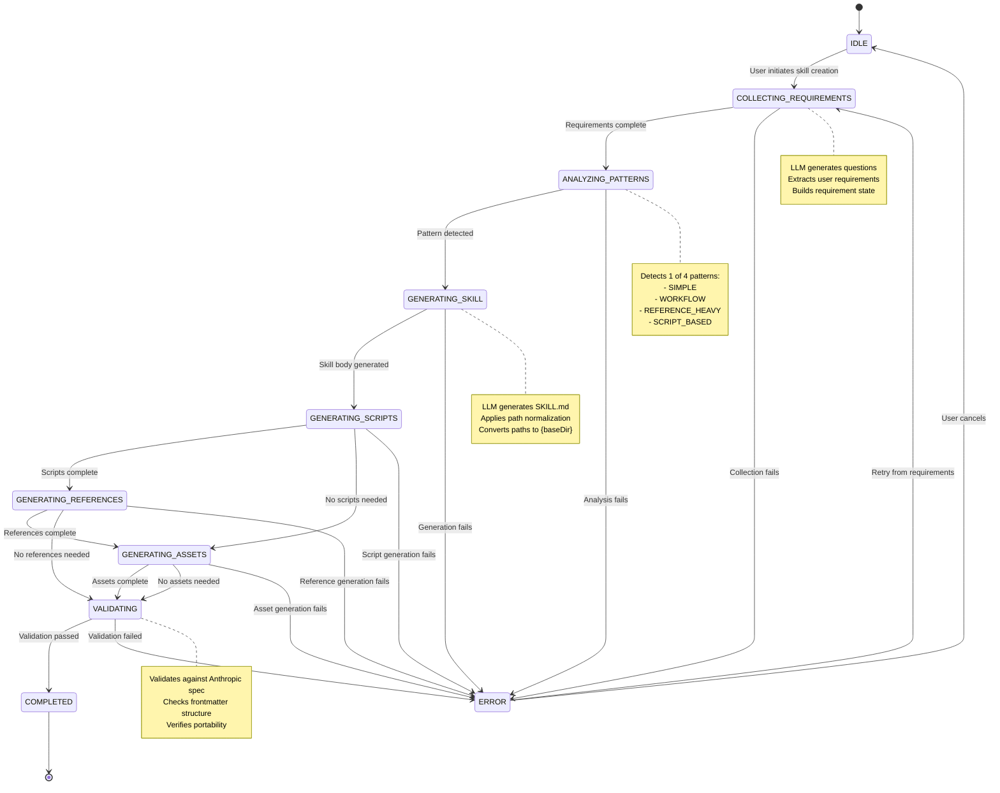
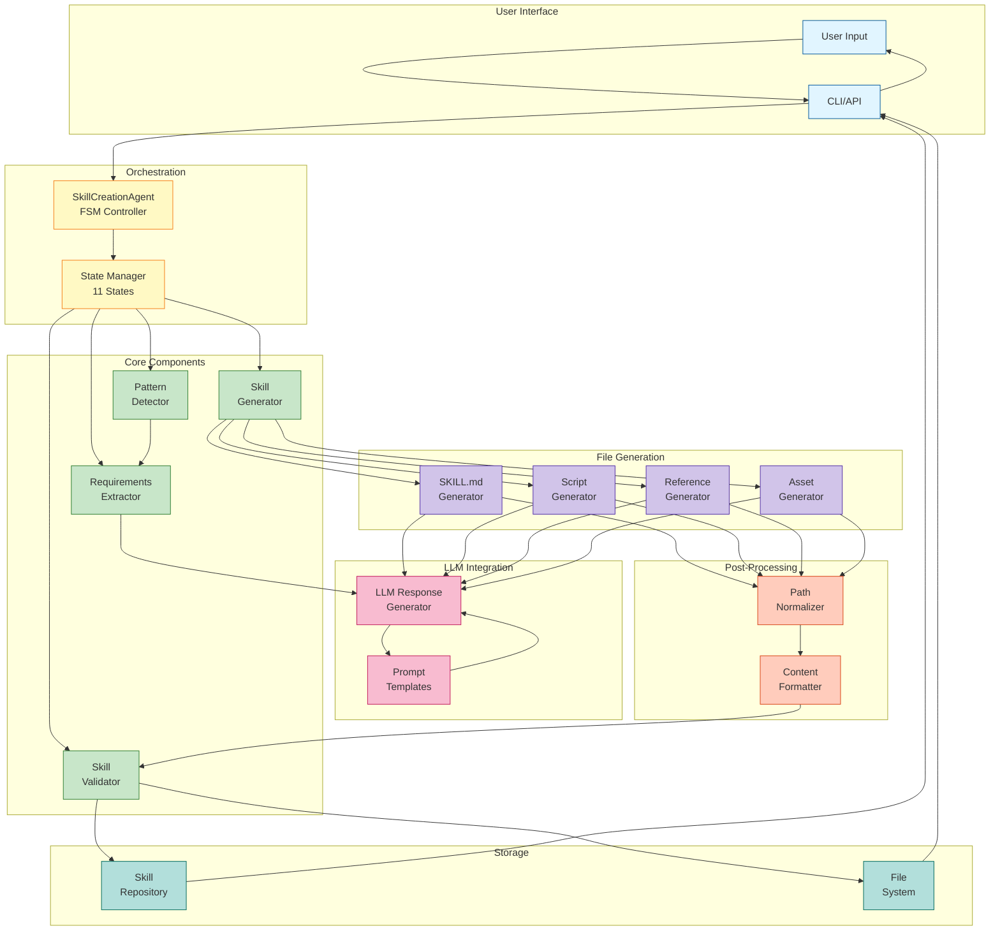
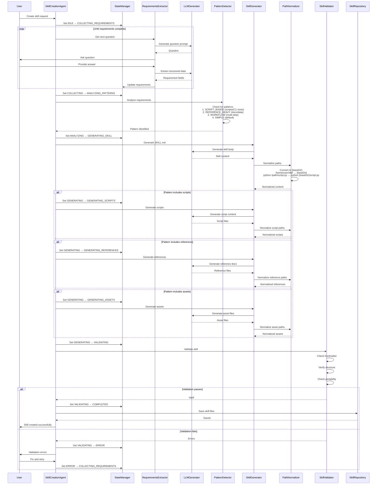
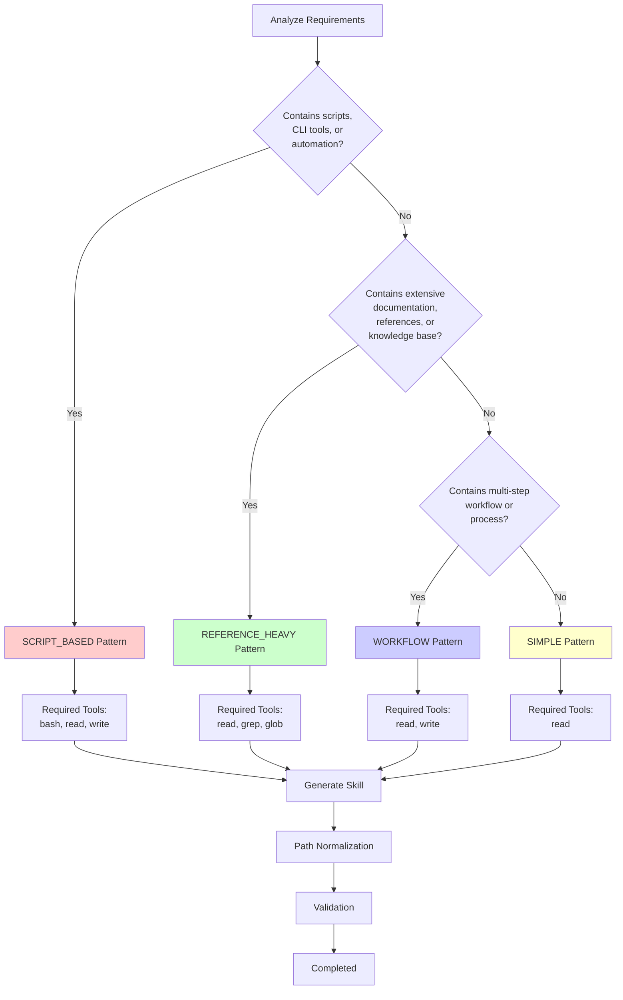

# Skill Creation System - Detailed Flow

## State Machine Diagram



## Component Interaction Diagram



## Detailed Sequence Flow



## Skill Patterns and Detection Logic



## Path Normalization Examples

### Before Normalization
```markdown
## Scripts

Run the analysis script:
```bash
python /Users/dev/omniforge/skills/my-skill/scripts/analyze.py
```

See the documentation at:
/home/user/omniforge/skills/my-skill/references/guide.md
```

### After Normalization
```markdown
## Scripts

Run the analysis script:
```bash
python {baseDir}/scripts/analyze.py
```

See the documentation at:
{baseDir}/references/guide.md
```

## Validation Rules

The SkillValidator enforces:

1. **Frontmatter Structure**
   - Required: `name`, `description`
   - Optional: `allowed-tools`, `priority`, `tags`
   - YAML format correctness

2. **Description Standards**
   - Third-person voice
   - Describes WHAT, not HOW
   - Clear activation triggers (WHEN)

3. **Portability**
   - No absolute paths (must use `{baseDir}`)
   - Platform-independent commands
   - No hardcoded credentials or secrets

4. **Content Organization**
   - Clear section structure
   - Concrete examples
   - Actionable guidance

5. **Tool Permissions**
   - All required tools declared
   - Minimal permission scope
   - Security-conscious defaults

## Key Components Details

### SkillCreationAgent (src/omniforge/skills/creation/agent.py)
- FSM controller orchestrating the entire creation process
- Manages state transitions across 11 states
- Coordinates LLM interactions and component calls
- ~500 LOC

### RequirementsExtractor (src/omniforge/skills/creation/extractor.py)
- Generates contextual questions for users
- Extracts structured requirement data from responses
- Builds comprehensive requirement state
- ~400 LOC

### PatternDetector (src/omniforge/skills/creation/detector.py)
- Analyzes requirements to identify skill patterns
- Maps patterns to required tools and resources
- Determines generation strategy
- ~300 LOC

### SkillGenerator (src/omniforge/skills/creation/generator.py)
- Generates SKILL.md content via LLM
- Creates scripts, references, and assets
- Applies path normalization
- Formats final output
- ~1,200 LOC

### PathNormalizer (in SkillGenerator)
- Detects absolute path patterns
- Converts to `{baseDir}` placeholder
- Handles multiple path formats (Unix, Windows)
- Ensures portability
- ~150 LOC

### SkillValidator (src/omniforge/skills/creation/validator.py)
- Validates against Anthropic specification
- Checks frontmatter structure and content
- Verifies portability (no hardcoded paths)
- Provides detailed error messages
- ~600 LOC

## LLM Prompts Structure

### Question Generation Prompt
```python
GENERATE_QUESTION_PROMPT = """
Given the current skill requirements:
{current_requirements}

Generate the next question to ask the user.
Focus on: {focus_area}

Return JSON:
{
  "question": "...",
  "rationale": "..."
}
"""
```

### Skill Body Generation Prompt
```python
GENERATE_SKILL_BODY_PROMPT = """
Generate a SKILL.md file for:
- Name: {name}
- Description: {description}
- Pattern: {pattern}

CRITICAL: Use {baseDir} for all paths.

Requirements:
{requirements}

Follow Anthropic Claude Skills specification.
"""
```

### Script Generation Prompt
```python
GENERATE_SCRIPT_PROMPT = """
Generate a {language} script for:
{script_purpose}

CRITICAL: Use {baseDir} for all file references.

Example:
# Good: config_path = os.path.join(os.environ['baseDir'], 'config.yaml')
# Bad: config_path = '/home/user/skill/config.yaml'
"""
```

## File Output Structure

```
skills/my-skill/
├── SKILL.md                 # Main skill definition
├── scripts/                 # Generated scripts (if SCRIPT_BASED)
│   ├── main.py
│   └── utils.py
├── references/              # Reference documentation (if REFERENCE_HEAVY)
│   ├── guide.md
│   └── examples.md
└── assets/                  # Asset files (if needed)
    ├── template.json
    └── data.csv
```

## Performance Metrics

| Operation | Average Time | LLM Calls |
|-----------|--------------|-----------|
| Requirements Collection | 30-60s | 3-7 |
| Pattern Detection | <1s | 0 |
| Skill Generation | 10-20s | 1 |
| Script Generation | 5-10s each | 1 per script |
| Reference Generation | 5-10s each | 1 per reference |
| Validation | <1s | 0 |
| **Total** | **60-120s** | **5-15** |

## Error Handling

The system handles errors at multiple levels:

1. **State Level**: ERROR state for recovery
2. **Component Level**: Try-catch with detailed logging
3. **LLM Level**: Retry logic with backoff
4. **Validation Level**: Detailed error messages for user correction

## Recent Improvements (February 2026)

✅ **Path Normalization**: Comprehensive `{baseDir}` conversion
✅ **Enhanced Prompts**: Explicit portability requirements
✅ **Dual Validation**: LLM prompts + post-processing
✅ **Pattern Detection**: 4 distinct patterns
✅ **FSM Refinement**: 11-state workflow
✅ **Test Coverage**: 203 passing tests

## Known Gaps

⚠️ **Tool Permissions**: `determine_required_tools()` is stubbed
⚠️ **Reference Generation**: Missing directory creation
⚠️ **Asset Generation**: Missing directory creation
⚠️ **Interactive Editing**: No in-flow editing capability
