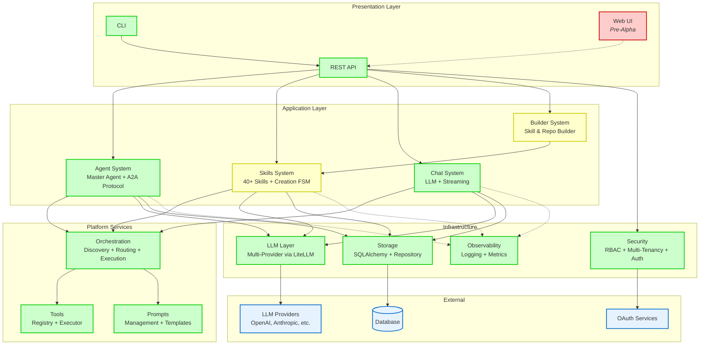
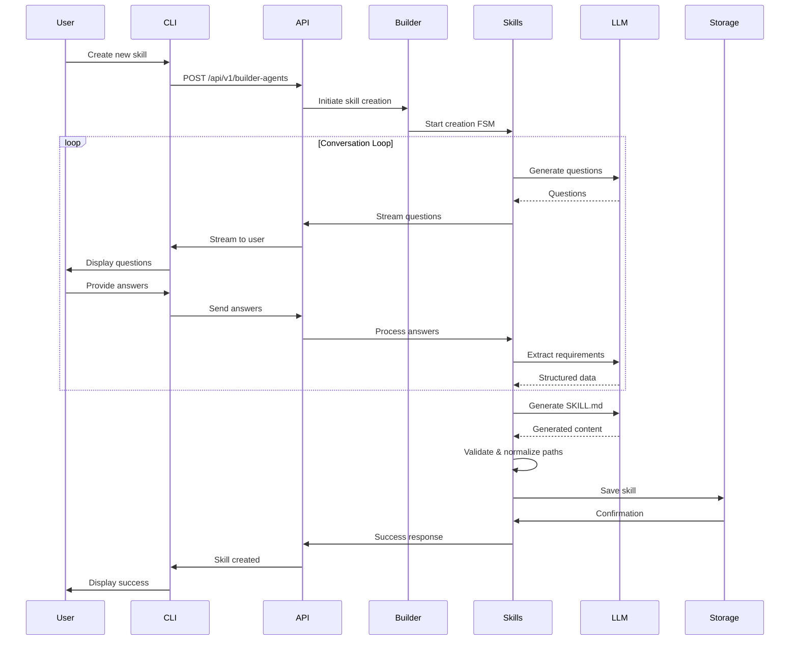
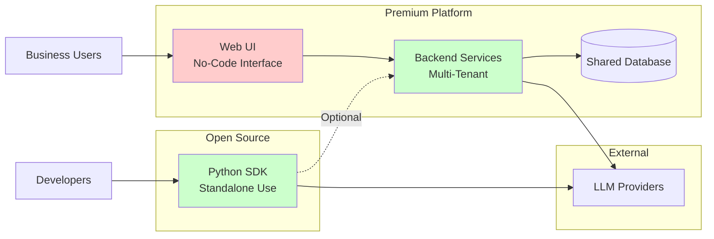

# OmniForge System Overview

## Simplified Architecture View

## System Layers

### 1. Presentation Layer
User-facing interfaces for interacting with the platform.

- **CLI**: Command-line interface (Production)
- **Web UI**: React/Next.js interface (Pre-Alpha)
- **REST API**: FastAPI-based HTTP API (Production)

### 2. Application Layer
Core business logic and domain models.

- **Agent System**: Master agent orchestration with A2A protocol (Production)
- **Skills System**: 40+ pre-built skills + FSM-based creation system (MVP)
- **Chat System**: LLM-powered chat with streaming (Production)
- **Builder System**: Automated skill and repository creation (MVP)

### 3. Platform Services
Cross-cutting platform capabilities.

- **Orchestration**: Service discovery, routing, and execution scheduling (Production)
- **Tools**: Centralized tool registry and execution (Production)
- **Prompts**: Prompt template management (Production)

### 4. Infrastructure
Foundation services and cross-cutting concerns.

- **LLM Layer**: Multi-provider LLM integration via LiteLLM (Production)
- **Storage**: SQLAlchemy-based data persistence with repository pattern (Production)
- **Security**: RBAC, multi-tenancy, and OAuth authentication (Production)
- **Observability**: Structured logging and metrics collection (Production)

### 5. External Systems
Third-party services and dependencies.

- **LLM Providers**: OpenAI, Anthropic, and other AI model providers
- **Database**: SQLite (dev) or PostgreSQL (production)
- **OAuth Services**: External authentication providers

## Data Flow Example: Creating a Skill

## Key Architecture Characteristics

### Strengths
✅ **Modular Design**: Clear separation of concerns across 20+ modules
✅ **Production Infrastructure**: Enterprise-grade storage, security, and observability
✅ **Multi-Provider LLM**: Vendor-agnostic with fallback support
✅ **Multi-Tenancy**: Built-in tenant isolation and RBAC
✅ **Async-First**: Full async/await support with FastAPI and SQLAlchemy
✅ **Comprehensive Testing**: 219 test files with pytest
✅ **Type Safety**: mypy with strict mode enabled

### Current Focus
🟡 **Skill Creation System**: FSM-based conversational builder (MVP - Feb 2026)
🟡 **Builder Automation**: Automated skill and repository generation (MVP)
🟡 **Pattern Detection**: Automatic skill pattern recognition (MVP)

### Development Needed
🔴 **Frontend**: React/Next.js implementation (Pre-Alpha - scaffolding only)
🔴 **Tool Permissions**: Auto-configuration based on skill patterns (Stub)
🔴 **Resource Generation**: Complete references/ and assets/ directory creation

## Deployment Model

### Dual Deployment Strategy
1. **Open Source SDK**: Python library for developers (Production)
   - Standalone usage with local LLM providers
   - Optional platform connectivity

2. **Premium Platform**: No-code chatbot interface (Pre-Alpha)
   - Multi-tenant SaaS deployment
   - Conversational skill creation
   - Enterprise features (governance, auditing, cost tracking)

## Technology Decisions

| Layer | Technology | Rationale |
|-------|------------|-----------|
| Web Framework | FastAPI | Async-first, automatic OpenAPI, high performance |
| ORM | SQLAlchemy | Mature, async/sync support, rich query API |
| LLM Integration | LiteLLM | Multi-provider, unified API, cost tracking |
| Testing | pytest | Industry standard, rich plugin ecosystem |
| Code Quality | black, ruff, mypy | Automated formatting, fast linting, type safety |
| Frontend | Next.js (planned) | React framework, SSR, routing, optimization |

## Lines of Code by Component

| Component | Lines of Code | Maturity |
|-----------|---------------|----------|
| Agent System | ~4,400 | Production |
| Skills System | ~4,600 | MVP |
| API Layer | ~3,000 | Production |
| Storage Layer | ~2,500 | Production |
| Security & Enterprise | ~2,000 | Production |
| Orchestration | ~1,800 | Production |
| Chat System | ~1,500 | Production |
| LLM Layer | ~1,200 | Production |
| Tools System | ~1,000 | Production |
| Prompts System | ~900 | Production |
| Builder System | ~800 | MVP |
| Observability | ~600 | Production |
| **Total Backend** | **~25,000** | - |
| Frontend | ~100 | Pre-Alpha |

## Recent Milestones (January-February 2026)

- ✅ Skill creation system MVP (4,600 LOC)
- ✅ Path normalization for portable skills
- ✅ Anthropic specification compliance
- ✅ 11-state FSM for conversational creation
- ✅ Pattern detection (4 patterns)
- ✅ LLM-powered requirements extraction
- ✅ Comprehensive test suite (203 skill tests)
- ⏳ Tool permissions automation (in progress)
- ⏳ Complete resource generation (in progress)
- ⏳ Frontend implementation (planned)
